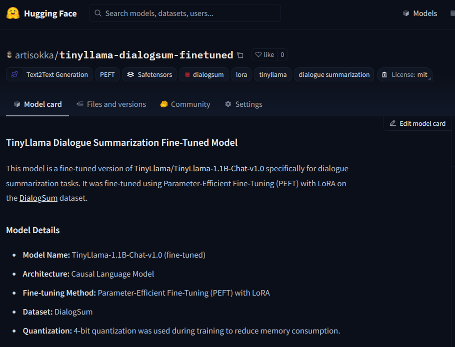

# TinyLlama Dialogue Summarization Fine-Tuning

This repository contains a Kaggle notebook for fine-tuning the TinyLlama-1.1B model for dialogue summarization using Parameter-Efficient Fine-Tuning (PEFT) with LoRA.

## Project Description

This project demonstrates how to fine-tune the TinyLlama-1.1B-Chat-v1.0 model to generate concise and accurate summaries from conversational text. It leverages the PEFT library with Low-Rank Adaptation (LoRA) to efficiently adapt the pre-trained model, reducing computational overhead and memory requirements. The training is performed on a dialogue summarization dataset.

## Model on HuggingFace


## Error fixes applied (available within notebook)
ERROR FIX:
```
RuntimeError: Input tensors need to be on the same GPU, but found the following tensor and device combinations: [(torch.Size([1, 3276800]), device(type='cuda', index=1)), (torch.Size([102400]), device(type='cuda', index=0)), (torch.Size([2560, 2560]), device(type='cuda', index=1))]
```
Fixed by appending the following code block to force resource allocation on the same device (GPU 0): bitsandbytes limitation

ERROR FIX: Changed use_auth_token to token
```
/usr/local/lib/python3.10/dist-packages/transformers/models/auto/auto_factory.py:471: FutureWarning: The `use_auth_token` argument is deprecated and will be removed in v5 of Transformers. Please use `token` instead.
  warnings.warn(
```
FIX: 
- Changed training args to match instructions
- Added label names

ERROR FIX: Changed file path to checkpoint-500

## Contents

* `tinyllama_dialogue_summarization.ipynb`: A Kaggle notebook containing the code for fine-tuning TinyLlama and evaluating its performance.

## Usage

1.  **Open the Kaggle Notebook:**
    * Open the `tinyllama_dialogue_summarization.ipynb` file in your Kaggle environment.
2.  **Set Up Your Environment:**
    * Ensure that you have the necessary libraries installed. The notebook includes `pip install` commands for the required packages.
    * Log in to the Hugging Face Hub using your access token.
    * If using GPU acceleration, make sure it is enabled in your Kaggle notebook settings.
3.  **Run the Notebook:**
    * Execute the cells in the notebook sequentially to fine-tune the TinyLlama model.
    * The notebook includes steps for data loading, preprocessing, model configuration, training, and evaluation.
4.  **Evaluate the Model:**
    * The notebook includes code to evaluate the fine-tuned model's performance using ROUGE scores.
5.  **Use the Fine-Tuned Model:**
    * After training, the notebook provides examples of how to use the fine-tuned model for dialogue summarization.
    * The model and tokenizer are pushed to the huggingface hub.

## Dependencies

* `bitsandbytes`
* `transformers`
* `peft`
* `accelerate`
* `datasets`
* `scipy`
* `einops`
* `evaluate`
* `trl`
* `rouge_score`
* `torch`

## Dataset

The notebook uses a dialogue summarization dataset (e.g., DialogSum) from the Hugging Face Datasets library.

## PEFT Configuration

The notebook utilizes LoRA with the following configuration:

* Rank (r): 32
* Lora Alpha: 32
* Target Modules: Attention layers (q_proj, k_proj, v_proj, o_proj)
* Lora Dropout: 0.05

## Training Details

* Training is performed using the `transformers.Trainer` class.
* The notebook includes training arguments for learning rate, batch size, and other hyperparameters.
* 4-bit quantization is used to reduce memory consumption.

## Evaluation

The model's performance is evaluated using ROUGE scores.

## License

This project is licensed under the MIT License.

## Acknowledgments

* TinyLlama developers.
* Hugging Face Transformers and PEFT teams.
* Kaggle for providing the platform.